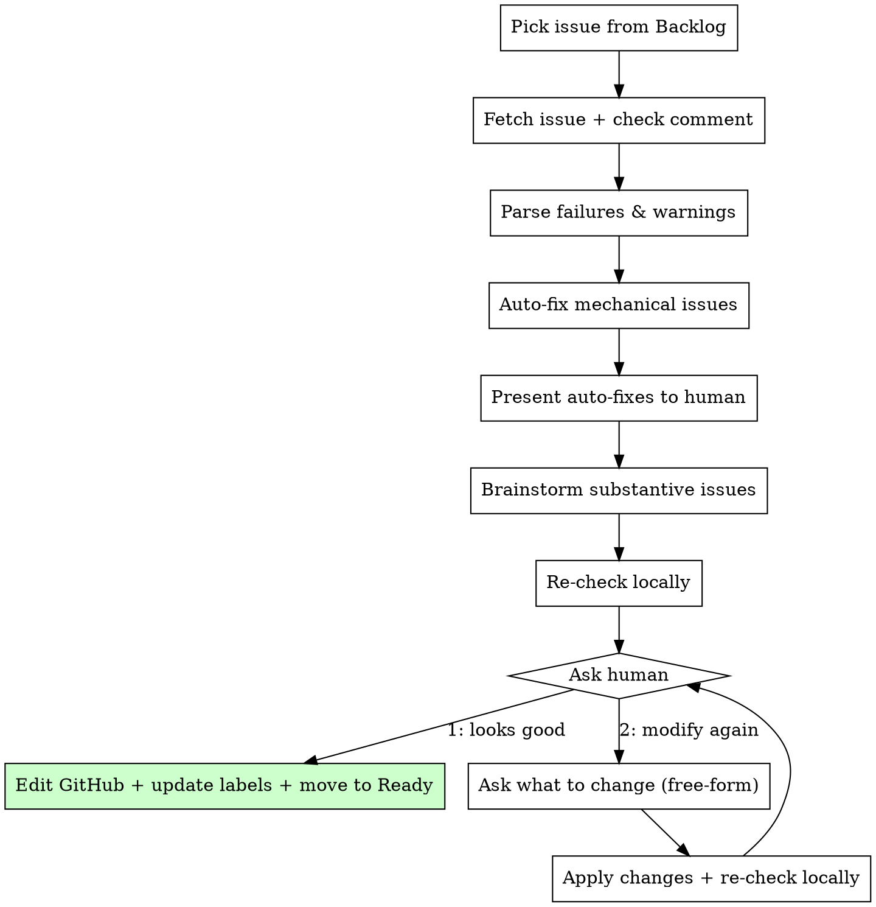

# Fix Issue

Fix errors and warnings from a `check-issue` report. Auto-fixes mechanical issues, brainstorms substantive ones with the human, edits the issue body, re-checks once, then asks the human to approve or iterate.

## Invocation

```
/fix-issue <model|rule>
```

## Constants

GitHub Project board IDs:

| Constant | Value |
|----------|-------|
| `PROJECT_ID` | `PVT_kwDOBrtarc4BRNVy` |
| `STATUS_FIELD_ID` | `PVTSSF_lADOBrtarc4BRNVyzg_GmQc` |
| `STATUS_BACKLOG` | `ab337660` |
| `STATUS_READY` | `f37d0d80` |

## Process



---

## Step 1: Pick Next Issue from Backlog

The argument is `model` or `rule` — determines which issue type (`[Model]` or `[Rule]`) to process.

### 1a: Fetch candidate list from project board

```bash
uv run --project scripts scripts/pipeline_board.py backlog <model|rule> --format json
```

Returns all Backlog issues of the requested type, sorted by `Good` label first then by issue number:

```json
{
  "issue_type": "rule",
  "items": [
    {"number": 246, "title": "[Rule] A → B", "has_good": true, "labels": ["Good", "rule"]},
    {"number": 91, "title": "[Rule] C to D", "has_good": false, "labels": ["rule"]}
  ]
}
```

### 1b: Pick the top issue

Pick the first item from the list. If the list is empty, STOP with message: "No `[Model]`/`[Rule]` issues in Backlog."

### 1c: Fetch the chosen issue

```bash
gh issue view <NUMBER> --json title,body,labels,comments
```

- Find the **most recent** comment that starts with `## Issue Quality Check` — this is the check-issue report
- If no check comment found, run `/check-issue <NUMBER>` first, then re-fetch the issue

---

## Step 2: Parse Failures and Warnings

Extract from the check comment's summary table:

| Field | How to extract |
|-------|---------------|
| Check name | First column (Usefulness, Non-trivial, Correctness, Well-written) |
| Result | Second column (Pass / Fail / Warn) |
| Details | Third column (one-line summary) |

Then parse the detailed sections below the table for specifics:
- Each `### <Check Name>` section contains the full explanation
- The `#### Recommendations` section (if present) contains suggestions

Build a structured list of **all issues to fix** — include both `Fail` **and** `Warn` results. Warnings are not ignorable; they must be resolved before moving to Ready.

Tag each issue as:
- `mechanical` — can be auto-fixed without human input
- `substantive` — requires human brainstorming

### Classification Rules

**Mechanical** (auto-fixable):

| Issue pattern | Fix strategy |
|--------------|-------------|
| Undefined symbol in overhead/algorithm | Add definition derived from context (e.g., "let n = \|V\|") |
| Inconsistent notation across sections | Standardize to the most common usage in the issue |
| Missing/wrong code metric names | Look up correct names via `pred show <target> --json` → `size_fields` |
| Formatting issues (broken tables, missing headers) | Reformat to match issue template |
| Incomplete `(TBD)` in fields derivable from other sections | Fill from context |
| Incorrect DOI format | Reformat to `https://doi.org/...` |

**Substantive** (brainstorm with human, ask for human's input):

| Issue pattern | Why human input needed |
|--------------|----------------------|
| Naming decisions (optimization prefix, CamelCase choice, too long name) | Codebase convention judgment call |
| Missing or incorrect complexity bounds | Requires literature verification |
| Missing type dependencies | Architectural decision about codebase |
| Incorrect mathematical claims | Domain expertise needed |
| Incomplete reduction algorithm | Core technical content |
| Incomplete or trivial example | Needs meaningful design, provide 3 options for the human to choose from |
| Decision vs optimization framing | Check associated `[Rule]` issues first — if a rule targets the decision version, implement that; if it targets optimization, implement that; if both exist, split into two separate model issues. Problem modeling choice |
| Ambiguous overhead expressions | Requires understanding the reduction |

---

## Step 3: Auto-Fix Mechanical Issues

For each `mechanical` issue:

1. Identify the exact section in the issue body that needs editing
2. Apply the fix
3. Record what was changed (for presenting to human in Step 4)

Use `pred show <problem> --json` to look up:
- Valid problem names and aliases
- `size_fields` for correct metric names
- Existing variants and fields

**Do NOT edit the issue on GitHub yet** — collect all fixes (mechanical + substantive) first.

---

## Step 4: Present Auto-Fixes to Human

Print a summary of all mechanical fixes applied:

```
## Auto-fixes applied

| # | Section | Issue | Fix |
|---|---------|-------|-----|
| 1 | Size Overhead | Symbol `m` undefined | Added ... |
```

Then present the substantive issues that need discussion:

```
## Issues requiring your input

1. **Decision vs optimization:** ...
```

---

## Step 5: Brainstorm Substantive Issues

For each substantive issue, present it to the human **one at a time**:

1. State the problem clearly
2. Offer 2-3 concrete options when possible (with your recommendation)
3. Wait for the human's response
4. Apply the chosen fix to the draft issue body

Use web search if needed to help resolve issues:
- Literature search for correct complexity bounds
- Verify algorithm claims
- Find better references

After all substantive issues are resolved, show the human the complete updated issue body (or a diff summary if the body is long).

---

## Step 6: Re-Check Locally

Re-run the 4 quality checks (Usefulness, Non-trivial, Correctness, Well-written) from `check-issue` against the **draft issue body** (not yet pushed to GitHub). Use `pred show`, `pred path`, web search as needed. Do NOT post a GitHub comment.

Print results to the human as a summary table (Check / Result / Details).

---

## Step 7: Ask Human for Decision

Show the human the draft issue body.

Use `AskUserQuestion` to present the options:

> The issue has been re-checked locally. What would you like to do?
>
> 1. **Looks good** — I'll push the edits to GitHub, update labels, and move it to Ready
> 2. **Modify again** — tell me what else you'd like to change

### If human picks 2: Modify Again

Ask the human (free-form) what they want to change:

> What would you like to modify? Describe the changes you want.

Apply the requested changes to the draft issue body, re-check locally (Step 6), then ask again (Step 7). Repeat until the human picks "Looks good".

---

## Step 8: Finalize (If human picks 1 "Looks good")

Only reached when the human approves. Now push everything to GitHub.

### 8a: Edit the issue body

Use the Write tool to save the updated body to `/tmp/fix_issue_body.md`, then:

```bash
gh issue edit <NUMBER> --body-file /tmp/fix_issue_body.md
```

### 8b: Comment on the issue with a changelog

Post a comment summarizing what was changed, so reviewers can see the diff at a glance:

```bash
gh issue comment <NUMBER> --body "$(cat <<'EOF'
## Fix-issue changelog

- <bullet for each change made, e.g. "Fixed undefined symbol `m` in Size Overhead section">
- ...

Applied by `/fix-issue`.
EOF
)"
```

### 8c: Update labels

```bash
gh issue edit <NUMBER> --remove-label "Useless,Trivial,Wrong,PoorWritten" 2>/dev/null
gh issue edit <NUMBER> --add-label "Good"
```

### 8d: Move to Ready on project board

Use the `item_id` obtained from Step 1a:

```bash
uv run --project scripts scripts/pipeline_board.py move <ITEM_ID> Ready
```

### 8e: Confirm

```text
Done! Issue #<NUMBER>:
  - Body updated on GitHub
  - Labels: removed failure labels, added "Good"
  - Board: moved to Ready
```

---

## Common Mistakes

| Mistake | Fix |
|---------|-----|
| Pushing to GitHub before human approves | All edits stay local until human picks "Looks good" |
| Hallucinating paper content for complexity bounds | Use web search; if not found, say so and ask human |
| Using `pred show` on a problem that doesn't exist yet | Check existence first; for new problems, skip metric lookup |
| Overwriting human's original content | Preserve original text; only modify the specific sections flagged |
| Not preserving `<!-- Unverified -->` markers | Keep existing provenance markers; add new ones for AI-filled content |
| Running check-issue more than once per iteration | Re-check exactly once after edits, then ask human |
| Closing the issue | Never close. Labels and board status only |
| Force-pushing or modifying git | This skill only edits GitHub issues via `gh`. No git operations |
| Inventing `pipeline_board.py` subcommands | Only `next`, `claim-next`, `ack`, `list`, `move`, `backlog` exist |
